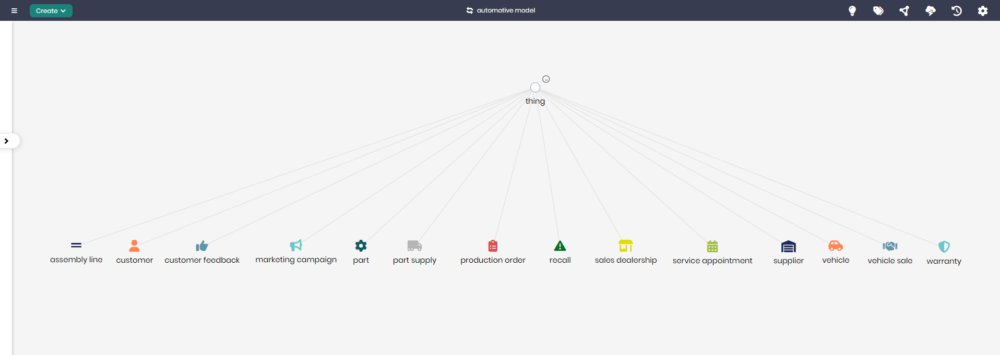

# Automotive Model

## Overview
The Automotive Model is designed to help organizations within the automotive industry manage various facets of the business, from vehicle production to customer interaction and after-sales services. This model organizes data related to key automotive components such as assembly lines, vehicles, and sales, providing a comprehensive structure for managing and optimizing processes across the entire automotive lifecycle.

The model connects core concepts like `Vehicle`, `Production Order`, and `Sales Dealership`, ensuring that all aspects of automotive management are accounted for and can be easily tracked and analyzed.

## Key Concepts
- **Vehicle**: Represents the vehicles being manufactured, sold, or serviced.
- **Production Order**: Represents orders for the production of vehicles or vehicle parts.
- **Sales Dealership**: Represents car dealerships responsible for vehicle sales.
- **Recall**: Manages records of vehicle recalls due to defects or safety issues.
- **Warranty**: Manages information related to warranties offered on vehicles or parts.

## Automotive Diagram

The model in Timbr’s Ontology Explorer, which provides a graphical interface to easily view and manage the concepts, properties, and relationships of the business model.

## SQL Setup
To implement the Automotive Model in Timbr, simply run the SQL script found in the [SQL Folder](./sql). This script will create the necessary entities and relationships within your knowledge graph.

## Implementation Guide
For step-by-step instructions on setting up this model in Timbr, refer to the tutorial located in the [Tutorial Folder](./tutorial). It will guide you through the process of accessing Timbr, creating a new knowledge graph, and running the SQL script in the SQL editor.
