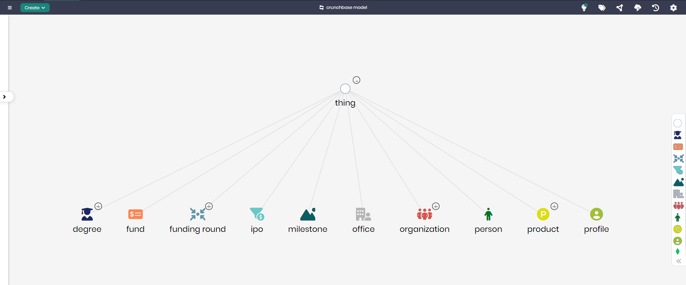

# Crunchbase Data Model

## Overview
The Crunchbase Data Model represents key data elements involved in the startup and venture capital ecosystem. This model captures data related to organizations, funding rounds, products, and milestones, providing a structured framework to analyze and manage business information from Crunchbase.

By organizing core concepts such as `Organization`, `Funding Round`, and `Product`, the model allows users to explore and gain insights into the dynamics of the startup world, including investments, IPOs, and key players in the industry.

## Key Concepts
- **Organization**: Represents companies or entities within the startup ecosystem.
- **Funding Round**: Tracks rounds of funding for startups, including seed, venture, and Series A/B/C stages.
- **IPO**: Represents Initial Public Offerings, where companies go public.
- **Product**: Refers to the products or services offered by startups.
- **Person**: Tracks individuals involved in the startup ecosystem, including founders, investors, and key employees.

## Crunchbase Data Diagram

The model in Timbr’s Ontology Explorer, which provides a graphical interface to easily view and manage the concepts, properties, and relationships of the business model.

## SQL Setup
To implement the Crunchbase Data Model in Timbr, simply run the SQL script found in the [SQL Folder](./sql). This script will create the necessary entities and relationships within your knowledge graph.

## Implementation Guide
For step-by-step instructions on setting up this model in Timbr, refer to the tutorial located in the [Tutorial Folder](./tutorial). It will guide you through the process of accessing Timbr, creating a new knowledge graph, and running the SQL script in the SQL editor.
