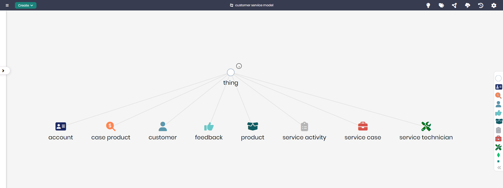

# Customer Service Model

## Overview
The Customer Service Model is designed to provide a comprehensive framework for managing customer support and service activities. This model captures key elements such as customer accounts, service cases, and feedback, providing a structure to improve customer service operations and track customer satisfaction. By leveraging this model, organizations can better manage their service cases, analyze customer feedback, and optimize their service activities.

## Key Concepts
- **Customer**: Represents the individual customers involved in the service cases.
- **Service Case**: Tracks individual service cases opened by customers.
- **Service Technician**: Represents the technicians responsible for handling service cases.
- **Feedback**: Captures customer feedback related to service and support activities.

## Customer Service Diagram

The model in Timbr’s Ontology Explorer, which provides a graphical interface to easily view and manage the concepts, properties, and relationships of the business model.

## SQL Setup
To implement the Customer Service Model in Timbr, simply run the SQL script found in the [SQL Folder](./sql). This script will create the necessary entities and relationships within your knowledge graph.

## Implementation Guide
For step-by-step instructions on setting up this model in Timbr, refer to the tutorial located in the [Tutorial Folder](./tutorial). It will guide you through the process of accessing Timbr, creating a new knowledge graph, and running the SQL script in the SQL editor.
