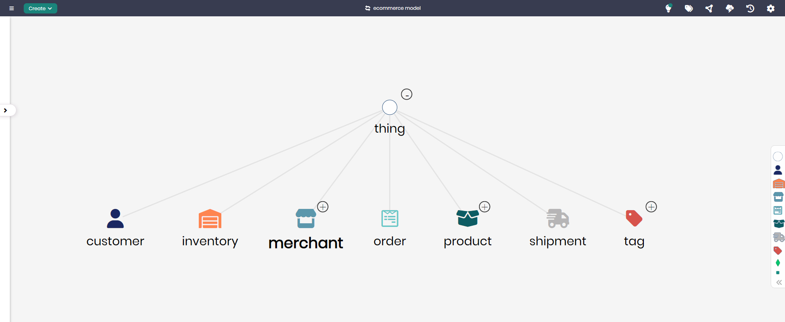

# E-commerce Model

## Overview
The E-commerce Model is designed to represent the essential components of an online retail environment. This model helps businesses manage customer interactions, track orders and shipments, and manage product inventories. It provides a structured framework to capture and analyze key data related to e-commerce transactions, helping organizations streamline operations and improve the customer experience.

## Key Concepts
- **Customer**: Represents the customers who are purchasing products.
- **Order**: Tracks customer orders, including details such as product and quantity.
- **Product**: Represents the products available for purchase.
- **Merchant**: Represents the sellers providing products in the marketplace.

## E-commerce Diagram

The model in Timbr’s Ontology Explorer, which provides a graphical interface to easily view and manage the concepts, properties, and relationships of the business model.

## SQL Setup
To implement the E-commerce Model in Timbr, simply run the SQL script found in the [SQL Folder](./sql). This script will create the necessary entities and relationships within your knowledge graph.

## Implementation Guide
For step-by-step instructions on setting up this model in Timbr, refer to the tutorial located in the [Tutorial Folder](./tutorial). It will guide you through the process of accessing Timbr, creating a new knowledge graph, and running the SQL script in the SQL editor.
