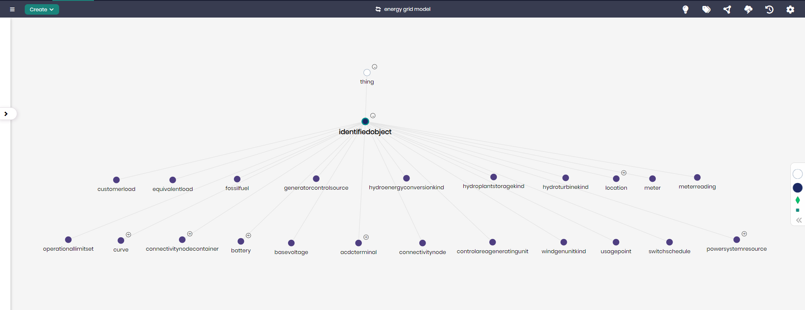

# Energy Grid Model

## Overview
The Energy Grid Model is designed to represent the components and data structures involved in managing and optimizing energy grids. This model includes essential concepts such as energy sources, power system resources, and usage points. It helps organizations manage energy distribution, monitor usage, and optimize grid performance, enabling efficient energy generation and consumption across various energy sources.

## Key Concepts
- **Power System Resource**: Represents the resources used to generate and distribute energy within the grid.
- **Usage Point**: Tracks the consumption of energy by various users or facilities.
- **Meter**: Captures energy usage data for accurate monitoring and billing.
- **Generator Control Source**: Manages the controls for energy generation units within the grid.

## Energy Grid Diagram

The model in Timbr’s Ontology Explorer, which provides a graphical interface to easily view and manage the concepts, properties, and relationships of the business model.

## SQL Setup
To implement the Energy Grid Model in Timbr, simply run the SQL script found in the [SQL Folder](./sql). This script will create the necessary entities and relationships within your knowledge graph.

## Implementation Guide
For step-by-step instructions on setting up this model in Timbr, refer to the tutorial located in the [Tutorial Folder](./tutorial). It will guide you through the process of accessing Timbr, creating a new knowledge graph, and running the SQL script in the SQL editor.
