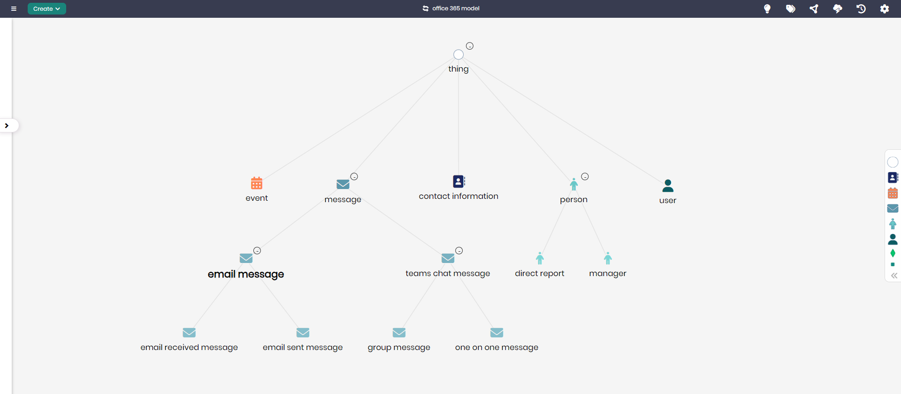

# Enterprise Communication Model

## Overview
The Enterprise Communication Model represents the key elements and relationships involved in managing communication within an organization. This model covers various communication methods including email messages, chat messages, and events, while also tracking user interactions and relationships such as direct reports and managers. It serves as a comprehensive framework for analyzing internal communication and collaboration in a workplace setting.

## Key Concepts
- **Email Message**: Represents email communication within the organization, tracking sent and received messages.
- **Teams Chat Message**: Tracks messages sent through Teams, including one-on-one and group messages.
- **Event**: Represents calendar events, such as meetings and appointments.
- **User**: Represents individual users within the organization.
- **Contact Information**: Tracks contact details related to people and organizations.
- **Direct Report**: Represents reporting relationships within the company, such as between an employee and their manager.

## Enterprise Communication Diagram

The model in Timbr’s Ontology Explorer, which provides a graphical interface to easily view and manage the concepts, properties, and relationships of the business model.

## SQL Setup
To implement the Enterprise Communication Model in Timbr, simply run the SQL script found in the [SQL Folder](./sql). This script will create the necessary entities and relationships within your knowledge graph.

## Implementation Guide
For step-by-step instructions on setting up this model in Timbr, refer to the tutorial located in the [Tutorial Folder](./tutorial). It will guide you through the process of accessing Timbr, creating a new knowledge graph, and running the SQL script in the SQL editor.
