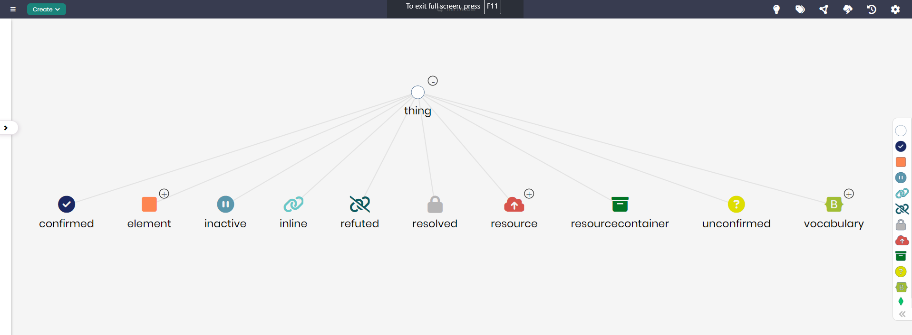

# FHIR Model

## Overview
The FHIR Model (Fast Healthcare Interoperability Resources) is designed to represent healthcare data in a standardized way to enable easy exchange and integration across healthcare systems. This model captures key elements such as confirmed resources, vocabulary, and resource containers, facilitating the management and interoperability of healthcare information in compliance with FHIR standards.

## Key Concepts
- **Confirmed**: Represents resources that have been verified and confirmed.
- **Resource**: Represents healthcare-related data entities that are being exchanged.
- **Vocabulary**: Captures the standard terminologies used across healthcare systems to ensure consistent communication.
- **Resource Container**: Groups related resources for better organization and management.

## FHIR Diagram

The model in Timbr’s Ontology Explorer, which provides a graphical interface to easily view and manage the concepts, properties, and relationships of the business model.

## SQL Setup
To implement the FHIR Model in Timbr, simply run the SQL script found in the [SQL Folder](./sql). This script will create the necessary entities and relationships within your knowledge graph.

## Implementation Guide
For step-by-step instructions on setting up this model in Timbr, refer to the tutorial located in the [Tutorial Folder](./tutorial). It will guide you through the process of accessing Timbr, creating a new knowledge graph, and running the SQL script in the SQL editor.
