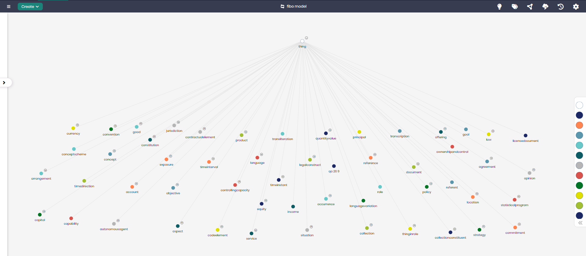

# FIBO Model

## Overview
The FIBO (Financial Industry Business Ontology) Model is designed to represent complex financial concepts and relationships. This model organizes and standardizes data related to financial agreements, institutions, securities, and other key financial instruments, facilitating data interoperability and clarity in financial communications and operations.

By capturing core concepts such as `Agreement`, `Account`, `Capital`, and `Ownership`, the FIBO Model enables organizations to better manage financial data and ensure compliance with financial standards.

## Key Concepts
- **Agreement**: Represents legal or contractual agreements within the financial industry.
- **Ownership and Control**: Captures the relationships regarding ownership and management of financial assets.
- **Account**: Represents accounts held by institutions or individuals within financial systems.
- **Capital**: Tracks financial capital and investments.
- **Equity**: Represents ownership interest in financial entities.

## FIBO Diagram

The model in Timbr’s Ontology Explorer, which provides a graphical interface to easily view and manage the concepts, properties, and relationships of the business model.

## SQL Setup
To implement the FIBO Model in Timbr, simply run the SQL script found in the [SQL Folder](./sql). This script will create the necessary entities and relationships within your knowledge graph.

## Implementation Guide
For step-by-step instructions on setting up this model in Timbr, refer to the tutorial located in the [Tutorial Folder](./tutorial). It will guide you through the process of accessing Timbr, creating a new knowledge graph, and running the SQL script in the SQL editor.
