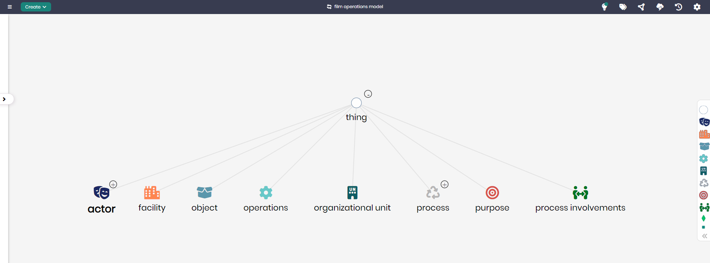

# Film Operations Model

## Overview
The Film Operations Model is designed to manage and optimize various aspects of film production operations. This model captures key elements such as actors, facilities, organizational units, and processes involved in film production. By providing a structured framework, this model helps film production companies streamline operations, ensure effective coordination between different departments, and track the involvement of various participants in the film production process.

## Key Concepts
- **Actor**: Represents individuals participating in the film production, including cast members.
- **Facility**: Tracks locations used in the production, such as studios, filming locations, or equipment storage.
- **Process**: Refers to the steps involved in the film production lifecycle.
- **Organizational Unit**: Represents different departments or teams involved in the film production process.

## Film Operations Diagram

The model in Timbr’s Ontology Explorer, which provides a graphical interface to easily view and manage the concepts, properties, and relationships of the business model.

## SQL Setup
To implement the Film Operations Model in Timbr, simply run the SQL script found in the [SQL Folder](./sql). This script will create the necessary entities and relationships within your knowledge graph.

## Implementation Guide
For step-by-step instructions on setting up this model in Timbr, refer to the tutorial located in the [Tutorial Folder](./tutorial). It will guide you through the process of accessing Timbr, creating a new knowledge graph, and running the SQL script in the SQL editor.
