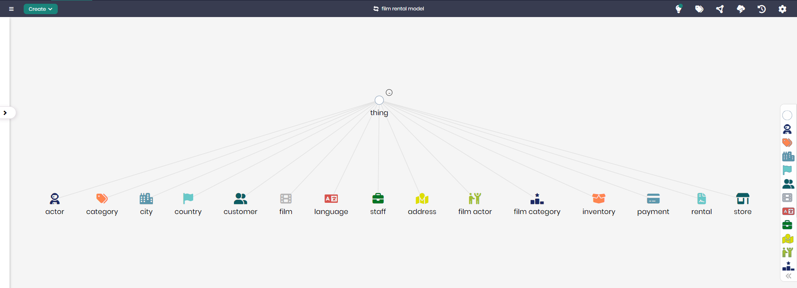

# Film Rental Model

## Overview
The Film Rental Model is designed to represent the various components involved in renting films to customers. This model helps organizations manage customer interactions, track rentals and payments, and categorize films effectively. By organizing key data such as films, actors, rentals, and inventory, this model enables efficient film rental operations, ensuring that films are tracked, available, and managed across different stores.

## Key Concepts
- **Customer**: Represents individuals renting films.
- **Film**: Represents the films available for rent.
- **Rental**: Tracks the details of the rental transactions between customers and stores.
- **Inventory**: Keeps track of film availability across different locations.
- **Payment**: Manages the payments associated with rentals.

## Film Rental Diagram

The model in Timbr’s Ontology Explorer, which provides a graphical interface to easily view and manage the concepts, properties, and relationships of the business model.

## SQL Setup
To implement the Film Rental Model in Timbr, simply run the SQL script found in the [SQL Folder](./sql). This script will create the necessary entities and relationships within your knowledge graph.

## Implementation Guide
For step-by-step instructions on setting up this model in Timbr, refer to the tutorial located in the [Tutorial Folder](./tutorial). It will guide you through the process of accessing Timbr, creating a new knowledge graph, and running the SQL script in the SQL editor.
