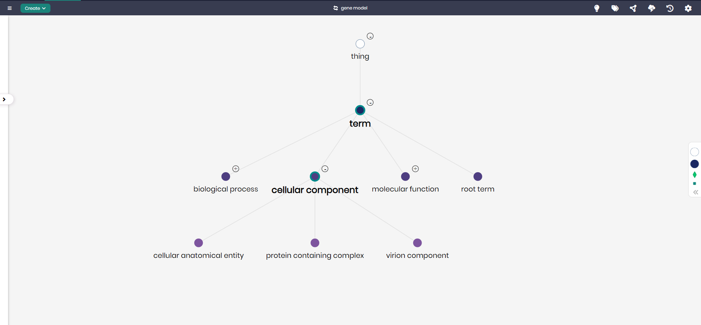

# Gene Model

## Overview
The Gene Model is designed to represent the various biological processes, cellular components, and molecular functions associated with genetic data. This model helps researchers and organizations in the field of biology and genetics organize and analyze data related to gene expression, protein complexes, and cellular structures. By structuring key data such as biological processes and molecular functions, the Gene Model enables a better understanding of how genes function within cells and organisms.

## Key Concepts
- **Biological Process**: Represents the processes that are carried out by one or more biological entities, such as gene regulation or cell signaling.
- **Cellular Component**: Tracks the locations within cells where gene-related processes occur, such as cellular structures or complexes.
- **Molecular Function**: Describes the biochemical activities carried out by gene products (like proteins) in the context of their molecular roles.

## Gene Diagram

The model in Timbr’s Ontology Explorer, which provides a graphical interface to easily view and manage the concepts, properties, and relationships of the business model.

## SQL Setup
To implement the Gene Model in Timbr, simply run the SQL script found in the [SQL Folder](./sql). This script will create the necessary entities and relationships within your knowledge graph.

## Implementation Guide
For step-by-step instructions on setting up this model in Timbr, refer to the tutorial located in the [Tutorial Folder](./tutorial). It will guide you through the process of accessing Timbr, creating a new knowledge graph, and running the SQL script in the SQL editor.
