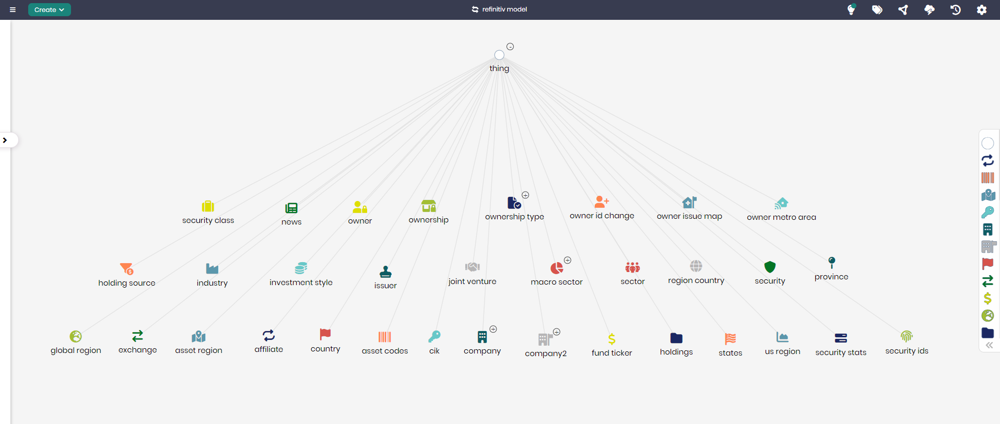

# Global Financial Data Model

## Overview
The Global Financial Data Model represents key financial entities and relationships, providing a comprehensive structure for analyzing global financial markets. This model is based on data from LSEG (formerly Refinitiv), covering a wide range of financial concepts, including securities, ownership, sectors, and regions. The model is designed to help financial institutions and analysts gain insights into financial data, ownership structures, market sectors, and much more.

## Key Concepts
- **Security**: Represents financial securities, including equities, bonds, and other investment instruments.
- **Owner**: Tracks ownership details related to financial assets.
- **Sector**: Categorizes companies and financial instruments into sectors such as technology, healthcare, etc.
- **Exchange**: Represents stock exchanges and other trading venues.
- **Region**: Tracks global regions, countries, and provinces for geographical analysis of financial data.

## Global Financial Data Diagram

The model in Timbr’s Ontology Explorer provides a graphical interface to easily view and manage the concepts, properties, and relationships of the financial data model.

## SQL Setup
To implement the Global Financial Data Model in Timbr, simply run the SQL script found in the [SQL Folder](./sql). This script will create the necessary entities and relationships within your knowledge graph.

## Implementation Guide
For step-by-step instructions on setting up this model in Timbr, refer to the tutorial located in the [Tutorial Folder](./tutorial). It will guide you through the process of accessing Timbr, creating a new knowledge graph, and running the SQL script in the SQL editor.
