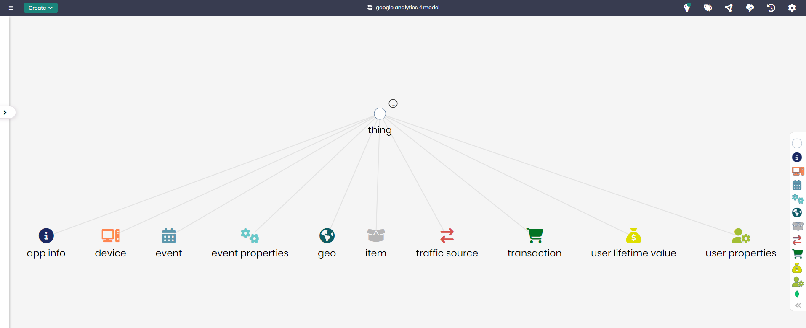

# Google Analytics 4 Model

## Overview
The Google Analytics 4 Model represents the core components used to analyze user interactions, transactions, and behavior across various digital platforms. This model is designed to help businesses track key data such as user engagement, traffic sources, and transaction details, providing a structured framework to gain insights into customer behavior and optimize digital performance.

## Key Concepts
- **Event**: Represents user interactions tracked across digital platforms, such as page views, clicks, or conversions.
- **Transaction**: Tracks purchase activities and order details across e-commerce platforms.
- **Traffic Source**: Captures the origin of users, such as organic search, paid ads, or referral sources.
- **User Properties**: Represents data about users, including demographics and behavior metrics.

## Google Analytics 4 Diagram

The model in Timbr’s Ontology Explorer, which provides a graphical interface to easily view and manage the concepts, properties, and relationships of the business model.

## SQL Setup
To implement the Google Analytics 4 Model in Timbr, simply run the SQL script found in the [SQL Folder](./sql). This script will create the necessary entities and relationships within your knowledge graph.

## Implementation Guide
For step-by-step instructions on setting up this model in Timbr, refer to the tutorial located in the [Tutorial Folder](./tutorial). It will guide you through the process of accessing Timbr, creating a new knowledge graph, and running the SQL script in the SQL editor.
