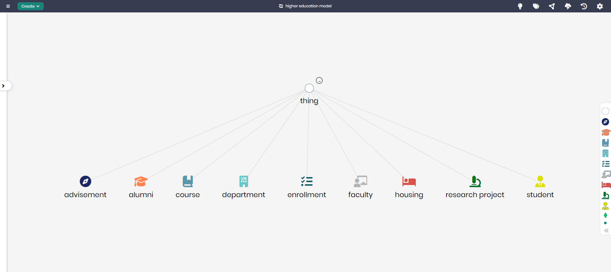

# Higher Education Model

## Overview
The Higher Education Model is designed to represent the core components and activities involved in managing academic institutions, such as universities and colleges. This model helps institutions manage data related to courses, students, faculty, research, and more. By organizing and structuring key educational concepts, this model enables better management of academic resources, student life, and institutional operations.

## Key Concepts
- **Course**: Represents the academic courses offered by the institution.
- **Student**: Tracks the students enrolled in courses and programs.
- **Faculty**: Represents the academic staff, including professors and lecturers.
- **Research Project**: Tracks the research initiatives undertaken by students and faculty.
- **Enrollment**: Manages the enrollment of students in courses and programs.

## Higher Education Diagram

The model in Timbr’s Ontology Explorer, which provides a graphical interface to easily view and manage the concepts, properties, and relationships of the business model.

## SQL Setup
To implement the Higher Education Model in Timbr, simply run the SQL script found in the [SQL Folder](./sql). This script will create the necessary entities and relationships within your knowledge graph.

## Implementation Guide
For step-by-step instructions on setting up this model in Timbr, refer to the tutorial located in the [Tutorial Folder](./tutorial). It will guide you through the process of accessing Timbr, creating a new knowledge graph, and running the SQL script in the SQL editor.
