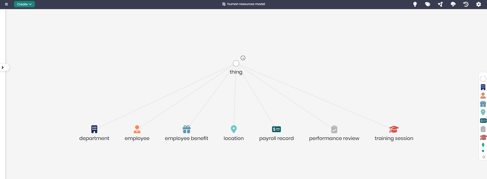

# Human Resources Model

## Overview
The Human Resources Model is designed to represent the core components and activities involved in managing employee relations, benefits, and performance within an organization. This model helps HR departments track and manage employee records, benefits, performance reviews, and training sessions, ensuring efficient human resource operations and employee satisfaction.

## Key Concepts
- **Employee**: Represents individuals employed by the organization.
- **Department**: Tracks the different departments within the organization.
- **Payroll Record**: Manages payroll information for employees.
- **Performance Review**: Tracks employee performance evaluations and feedback.
- **Training Session**: Organizes employee training programs and development sessions.

## Human Resources Diagram

The model in Timbr’s Ontology Explorer, which provides a graphical interface to easily view and manage the concepts, properties, and relationships of the business model.

## SQL Setup
To implement the Human Resources Model in Timbr, simply run the SQL script found in the [SQL Folder](./sql). This script will create the necessary entities and relationships within your knowledge graph.

## Implementation Guide
For step-by-step instructions on setting up this model in Timbr, refer to the tutorial located in the [Tutorial Folder](./tutorial). It will guide you through the process of accessing Timbr, creating a new knowledge graph, and running the SQL script in the SQL editor.
