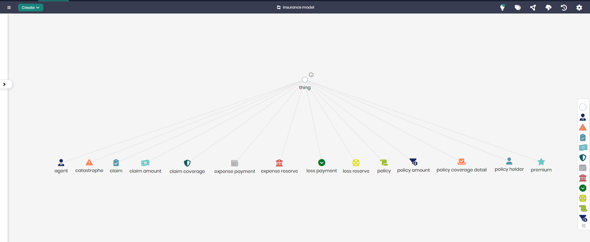

# Insurance Model

## Overview
The Insurance Model represents key elements and relationships involved in managing insurance policies, claims, and related financial activities. This model allows organizations to manage various types of insurance policies, process claims, and handle associated payments and reserves. It covers a wide range of insurance concepts, making it a comprehensive solution for insurers and related entities.

## Key Concepts
- **Policy**: Represents insurance policies issued to policyholders.
- **Claim**: Tracks claims made against insurance policies by policyholders.
- **Premium**: Manages the premium payments associated with insurance policies.
- **Loss Reserve**: Represents the estimated liability for unpaid insurance claims.
- **Agent**: Tracks the agents responsible for managing the insurance policies and claims.

## Insurance Diagram

The model in Timbr’s Ontology Explorer, which provides a graphical interface to easily view and manage the concepts, properties, and relationships of the business model.

## SQL Setup
To implement the Insurance Model in Timbr, simply run the SQL script found in the [SQL Folder](./sql). This script will create the necessary entities and relationships within your knowledge graph.

## Implementation Guide
For step-by-step instructions on setting up this model in Timbr, refer to the tutorial located in the [Tutorial Folder](./tutorial). It will guide you through the process of accessing Timbr, creating a new knowledge graph, and running the SQL script in the SQL editor.
