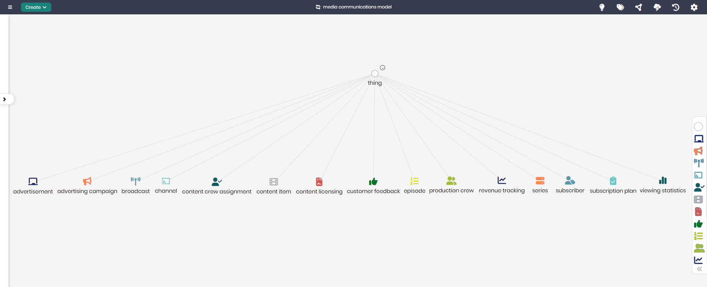

# Media Communications Model

## Overview
The Media Communications Model represents key elements and relationships involved in the broadcasting, content production, and audience interaction industries. This model enables organizations to manage advertisements, media content, customer feedback, and subscription plans, making it a comprehensive solution for media companies, broadcasters, and content creators.

## Key Concepts
- **Advertisement**: Represents advertising content placed within or alongside media.
- **Broadcast**: Tracks the broadcasting of media across various channels.
- **Episode**: Represents individual episodes of series within media content.
- **Subscription Plan**: Manages the subscription plans available to viewers for accessing content.
- **Customer Feedback**: Collects feedback from customers regarding media content and services.

## Media Communications Diagram

The model in Timbr’s Ontology Explorer, which provides a graphical interface to easily view and manage the concepts, properties, and relationships of the business model.

## SQL Setup
To implement the Media Communications Model in Timbr, simply run the SQL script found in the [SQL Folder](./sql). This script will create the necessary entities and relationships within your knowledge graph.

## Implementation Guide
For step-by-step instructions on setting up this model in Timbr, refer to the tutorial located in the [Tutorial Folder](./tutorial). It will guide you through the process of accessing Timbr, creating a new knowledge graph, and running the SQL script in the SQL editor.
