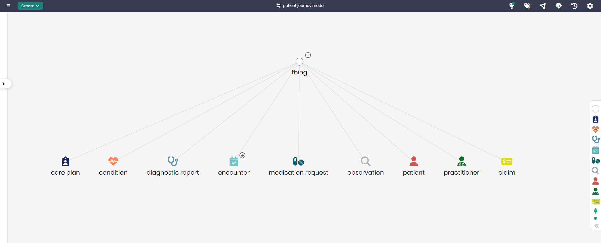

# Patient Journey Model

## Overview
The Patient Journey Model provides a detailed framework for tracking and managing a patient's entire healthcare journey, from diagnosis to treatment. This model covers key healthcare concepts such as conditions, encounters, care plans, and claims, ensuring that every aspect of a patient's journey is properly recorded and managed. It is an essential model for healthcare providers aiming to deliver comprehensive and efficient patient care.

## Key Concepts
- **Patient**: Represents the individual receiving medical care.
- **Condition**: Tracks medical conditions diagnosed in the patient.
- **Encounter**: Records each interaction the patient has with a healthcare provider.
- **Care Plan**: Represents the treatment plan designed for the patient’s condition(s).
- **Medication Request**: Manages requests for medications prescribed as part of the treatment.
- **Diagnostic Report**: Contains results from diagnostic tests and evaluations.
- **Claim**: Tracks financial claims submitted to insurance companies for the patient’s care.

## Patient Journey Diagram

The model in Timbr’s Ontology Explorer, which provides a graphical interface to easily view and manage the concepts, properties, and relationships of the business model.

## SQL Setup
To implement the Patient Journey Model in Timbr, simply run the SQL script found in the [SQL Folder](./sql). This script will create the necessary entities and relationships within your knowledge graph.

## Implementation Guide
For step-by-step instructions on setting up this model in Timbr, refer to the tutorial located in the [Tutorial Folder](./tutorial). It will guide you through the process of accessing Timbr, creating a new knowledge graph, and running the SQL script in the SQL editor.
