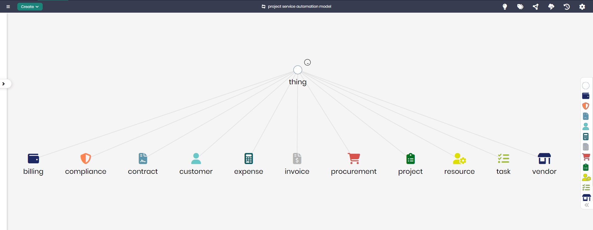

# Project Service Automation Model

## Overview
The Project Service Automation Model represents the key components involved in managing and automating various project-related services such as billing, compliance, procurement, and resource management. This model enables organizations to automate the processes associated with project delivery, including managing tasks, resources, vendors, and finances, providing a comprehensive solution for project-based operations.

## Key Concepts
- **Project**: Represents the main project entity, encapsulating all related tasks, resources, and financial aspects.
- **Task**: Defines specific activities or work to be completed as part of the project.
- **Resource**: Represents resources such as personnel or materials allocated to the project.
- **Invoice**: Tracks financial transactions related to the project, including payments and billing.
- **Contract**: Manages agreements between the project and external entities or vendors.
- **Customer**: Represents the client for whom the project is being delivered.
- **Procurement**: Handles the purchase of goods and services needed for the project.
- **Vendor**: Tracks suppliers or service providers involved in the project.

## Project Service Automation Diagram

The model in Timbr’s Ontology Explorer provides a graphical interface to easily view and manage the concepts, properties, and relationships of the business model.

## SQL Setup
To implement the Project Service Automation Model in Timbr, simply run the SQL script found in the [SQL Folder](./sql). This script will create the necessary entities and relationships within your knowledge graph.

## Implementation Guide
For step-by-step instructions on setting up this model in Timbr, refer to the tutorial located in the [Tutorial Folder](./tutorial). It will guide you through the process of accessing Timbr, creating a new knowledge graph, and running the SQL script in the SQL editor.
