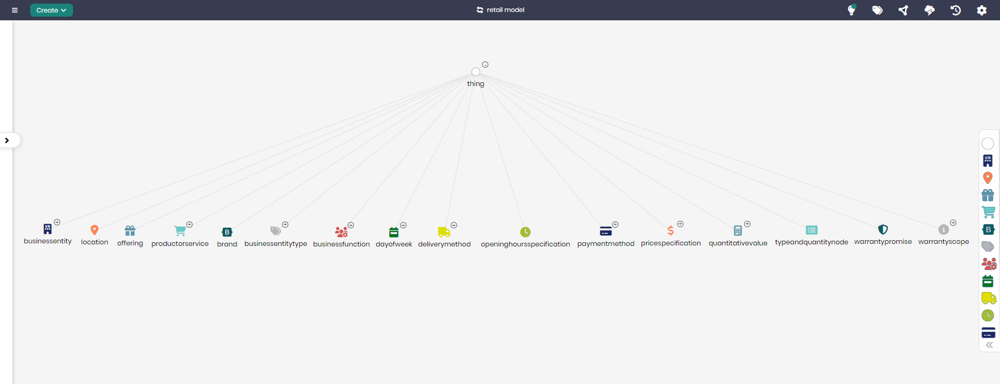

# Retail Operations Model

## Overview
The Retail Operations Model provides a comprehensive structure for managing various retail entities and their operations. It includes essential concepts like business entities, product offerings, payment methods, and delivery logistics. This model is ideal for retail businesses looking to manage operations efficiently by integrating various components of their service and product delivery.

## Key Concepts
- **Business Entity**: Represents the primary business involved in retail operations.
- **Location**: Manages the locations associated with the retail operations, such as stores or warehouses.
- **Offering**: Represents the products or services available for sale.
- **Payment Method**: Details the accepted payment methods for transactions.
- **Delivery Method**: Tracks the methods available for delivering products to customers.
- **Price Specification**: Manages pricing details for products and services, including discounts and surcharges.
- **Warranty**: Tracks the warranty information associated with certain products or services.
- **Business Function**: Represents the various functional areas within the business, such as sales, support, or logistics.

## Retail Operations Diagram

The model in Timbr’s Ontology Explorer provides a graphical interface to easily view and manage the concepts, properties, and relationships of the retail operations model.

## SQL Setup
To implement the Retail Operations Model in Timbr, simply run the SQL script found in the [SQL Folder](./sql). This script will create the necessary entities and relationships within your knowledge graph.

## Implementation Guide
For step-by-step instructions on setting up this model in Timbr, refer to the tutorial located in the [Tutorial Folder](./tutorial). It will guide you through the process of accessing Timbr, creating a new knowledge graph, and running the SQL script in the SQL editor.
