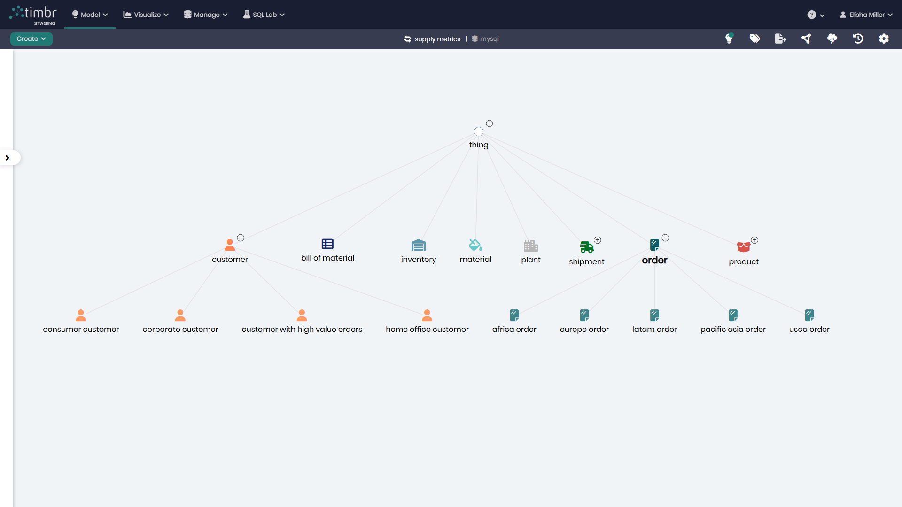

# Supply Chain Model

## Overview
The Supply Chain Model represents the key elements and relationships across orders, products, materials, shipments, plants, inventory, and customers. This model lets organizations analyze order flow, product mix, material costs, inventory, and shipping performance. It serves as a comprehensive framework for supply chain analytics and tracking end-to-end operations.

## Key Concepts
- **Order**: Commercial transactions with pricing, status, market, and dates.
- **Product**: Sellable items with category, department, and attributes.
- **Material**: Inputs used in products, including per-kg pricing and delivery times.
- **Shipment**: Delivery records with mode, dates, and late delivery risk.
- **Customer**: Buyers and segments connected to orders and shipments.
- **Inventory**: Stock locations, quantities, and product assignments.
- **Plant**: Production facilities and their shipped-to relationships.
- **Bill of Material**: Product composition with material ratios and quantities.

## Supply Chain Diagram

The model in Timbr’s Ontology Explorer, which provides a graphical interface to easily view and manage the concepts, properties, and relationships of the business model.

## SQL Setup
To implement the Supply Chain Model in Timbr, simply run the SQL script found in the [SQL Folder](./sql/supply_chain_model.sql). This script will create the necessary entities, relationships, measures, mappings, cubes, and views within your knowledge graph.

## Implementation Guide
For step-by-step instructions on setting up this model in Timbr, refer to the tutorial located in the [Tutorial Folder](./tutorial/how_to_setup_supply_chain_model.md). It will guide you through the process of accessing Timbr, creating a new knowledge graph, and running the SQL script in the SQL editor.
