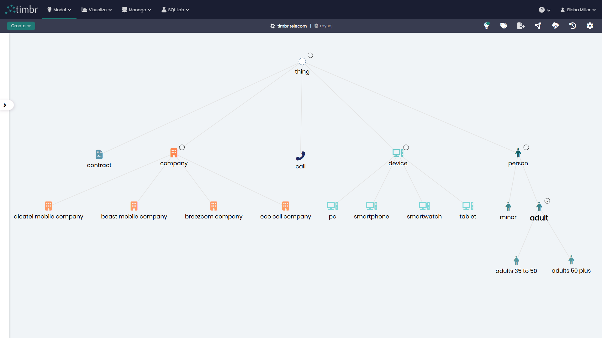

# Telecommunications Model

## Overview
The Telecommunications Model represents the key elements and relationships within a telecom ecosystem, including people, devices, calls, companies, and contracts. This model enables organizations to analyze call patterns, device usage, provider technologies, and customer segments while ensuring consistent mappings from raw telecom data into a unified knowledge graph.

## Key Concepts
- **Person**: Individuals with demographics and contact details, linked to contracts, devices, and calls. Includes sub-categories such as `minor`, `adult`, `adults_35_to_50`, and `adults_50_plus`.
- **Device**: Equipment owned by people and used to make calls, including device types such as `pc`, `smartphone`, `smartwatch`, and `tablet`.
- **Call**: Records of calls made between people, with details such as start time, duration, caller, callee, and the device used.
- **Contract**: Agreements between a person and a company, including contract type, contract date, and linked phone numbers.
- **Company**: Service providers with company names and associated technologies. Includes providers like `alcatel_mobile_company`, `beast_mobile_company`, `breezcom_company`, and `eco_cell_company`.

## Telecommunications Diagram

The model in Timbr’s Ontology Explorer provides a graphical interface to easily view and manage the concepts, properties, and relationships of the business model.

## SQL Setup
To implement the Telecommunications Model in Timbr, simply run the SQL script found in the 
[SQL Folder](./sql/telecommunications_model.sql). This script will create the necessary entities, relationships, measures, mappings, cubes, and views within your knowledge graph.

## Implementation Guide
For step-by-step instructions on setting up this model in Timbr, refer to the tutorial located in the 
[Tutorial Folder](./tutorial/how_to_setup_telecommunications_model.md). It will guide you through the process of accessing Timbr, creating a new knowledge graph, and running the SQL script in the SQL editor.
