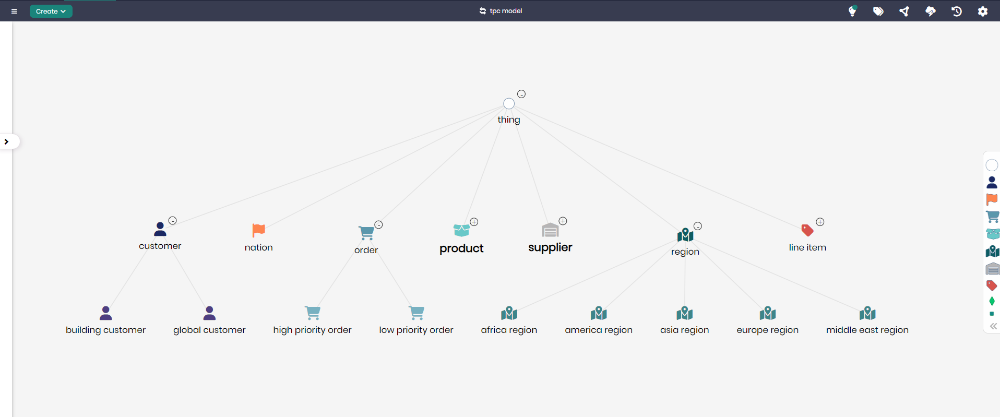

# TPC Benchmark Model

## Overview
The TPC Benchmark Model represents a comprehensive structure based on the Transaction Processing Performance Council (TPC) benchmark standards. It models various entities involved in a typical transactional system, including customers, orders, products, suppliers, and regions. This model is designed to measure the performance and effectiveness of systems handling large volumes of transactions and operations across multiple regions and sectors.

## Key Concepts
- **Customer**: Represents different types of customers, including building and global customers, involved in transactions.
- **Order**: Tracks high and low priority orders placed by customers.
- **Product**: Represents the items being ordered and sold within the transactional system.
- **Supplier**: Tracks the suppliers providing the products for orders.
- **Region**: Defines various regions such as Africa, America, Asia, Europe, and the Middle East, helping to categorize suppliers and customers based on geographic location.

## TPC Benchmark Diagram

The model in Timbr’s Ontology Explorer provides a graphical interface to easily view and manage the concepts, properties, and relationships of the transactional benchmark model.

## SQL Setup
To implement the TPC Benchmark Model in Timbr, simply run the SQL script found in the [SQL Folder](./sql). This script will create the necessary entities and relationships within your knowledge graph.

## Implementation Guide
For step-by-step instructions on setting up this model in Timbr, refer to the tutorial located in the [Tutorial Folder](./tutorial). It will guide you through the process of accessing Timbr, creating a new knowledge graph, and running the SQL script in the SQL editor.
