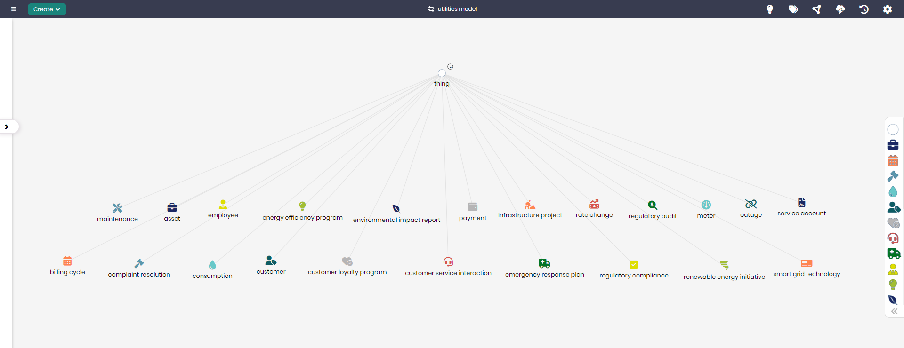

# Utilities Management Model

## Overview
The Utilities Management Model provides a comprehensive framework to manage various aspects of utility services. This model includes critical entities like customers, service accounts, billing cycles, infrastructure projects, and renewable energy initiatives. It supports utility providers in handling customer interactions, regulatory compliance, energy consumption, and service maintenance, facilitating a robust approach to utility management and innovation.

## Key Concepts
- **Customer**: Represents the individuals or businesses receiving utility services.
- **Service Account**: Tracks the service accounts tied to customers for utility services.
- **Billing Cycle**: Manages billing cycles associated with utility services and customer payments.
- **Outage**: Represents outages in utility services and manages their impact on customers.
- **Asset**: Tracks utility assets used in providing services to customers.
- **Energy Efficiency Program**: Monitors programs aimed at improving energy efficiency for customers and providers.
- **Infrastructure Project**: Represents projects related to infrastructure development and upgrades within the utility network.
- **Regulatory Compliance**: Ensures that utility operations comply with relevant regulations and policies.
- **Renewable Energy Initiative**: Manages initiatives aimed at increasing the use of renewable energy sources.
- **Smart Grid Technology**: Tracks advancements in smart grid technology and their implementation within the utility network.

## Utilities Management Diagram

The model in Timbr’s Ontology Explorer provides a graphical interface to easily view and manage the concepts, properties, and relationships of the utilities business model.

## SQL Setup
To implement the Utilities Management Model in Timbr, simply run the SQL script found in the [SQL Folder](./sql). This script will create the necessary entities and relationships within your knowledge graph.

## Implementation Guide
For step-by-step instructions on setting up this model in Timbr, refer to the tutorial located in the [Tutorial Folder](./tutorial). It will guide you through the process of accessing Timbr, creating a new knowledge graph, and running the SQL script in the SQL editor.
