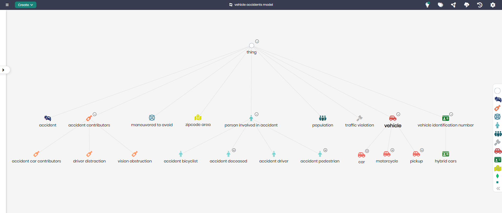

# Vehicle Accidents Model

## Overview
The Vehicle Accidents Model provides a structured representation of vehicle-related accidents, the contributing factors, and the entities involved. This model enables detailed analysis and tracking of accidents, including the types of vehicles, traffic violations, accident contributors, and the people involved. It is designed to support organizations like insurance companies, law enforcement agencies, and regulatory bodies in understanding and managing accident data efficiently.

## Key Concepts
- **Accident**: Represents an occurrence involving one or more vehicles, typically resulting in damage or injury.
- **Vehicle**: Represents the different types of vehicles involved in accidents, such as cars, motorcycles, pickups, and hybrid cars.
- **Person Involved in Accident**: Represents the people affected by the accident, including drivers, pedestrians, bicyclists, and those deceased in the accident.
- **Traffic Violation**: Represents any violations of traffic laws that contributed to the accident.
- **Accident Contributors**: Captures various factors that led to the accident, such as driver distraction, vision obstruction, and other external contributors.

## Vehicle Accidents Diagram

The model in Timbr’s Ontology Explorer provides a graphical interface to easily view and manage the concepts, properties, and relationships of the vehicle accidents domain.

## SQL Setup
To implement the Vehicle Accidents Model in Timbr, simply run the SQL script found in the [SQL Folder](./sql). This script will create the necessary entities and relationships within your knowledge graph.

## Implementation Guide
For step-by-step instructions on setting up this model in Timbr, refer to the tutorial located in the [Tutorial Folder](./tutorial). It will guide you through the process of accessing Timbr, creating a new knowledge graph, and running the SQL script in the SQL editor.
